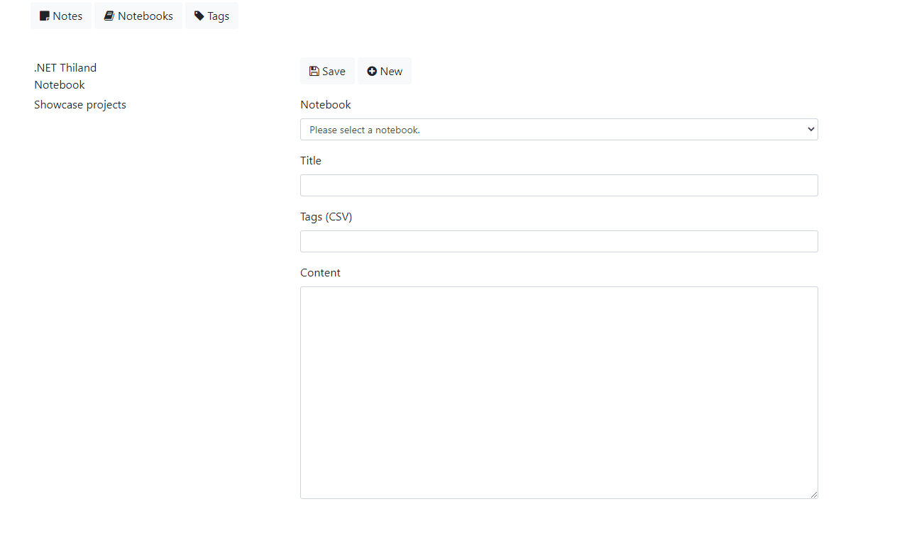

# Codesanook.EFNote

## How to run the project locally
- Clone the project to your computer.
```
$ git clone git@github.com:codesanook/Codesanook.EFNote.git
```
- CD to to the root folder.
``
$ cd Codesanook.EFNote.git
``
- Launch Docker containers.
```
$ docker compose down --volumes; docker-compose up --build
```
- Wait for a while until you see dotnet watch messages, e.g.
```
web_1  | watch : Process id 384 ran for 579ms
web_1  | watch : Watching 80 file(s) for changes
web_1  | watch : Watch command can be configured to use --no-restore.
web_1  | watch : No restore arguments: run --no-restore --urls http://*:80 --no-launch-profile
web_1  | watch : dotnet-watch is configured to launch a browser on ASP.NET Core application startup.
web_1  | watch : Refresh server running at ws://127.0.0.1:43557.
web_1  | watch : Started '/usr/share/dotnet/dotnet' 'run --urls http://*:80 --no-launch-profile' with process id 431
web_1  | watch : Running dotnet with the following arguments: run --urls http://*:80 --no-launch-profile
web_1  | watch : Started
```
- Open a browser and navigate to http://localhost:8000/
- You will find a simple note app that you can 
    - Add a new notebook which is a group/container of each note  
    - Add a new note.
    - Add a new tag.
    - Update/Delete notebook, note and tag.

## Hot reload
- Edit some C# source code in `app` folder. 
- Code will be compile automatically.
- Refresh a browser and see what you have changed.

## EF Note in a browser 



## Release compose
``` 
docker compose down --volumes; docker-compose -f docker-compose.yml -f docker-compose.release.yml up --build
```

## TODO
- [ ] wrong count number
- [ ] Can't delete notebook
- [ ] Refactor repository
- [ ] Remove cookie warning
